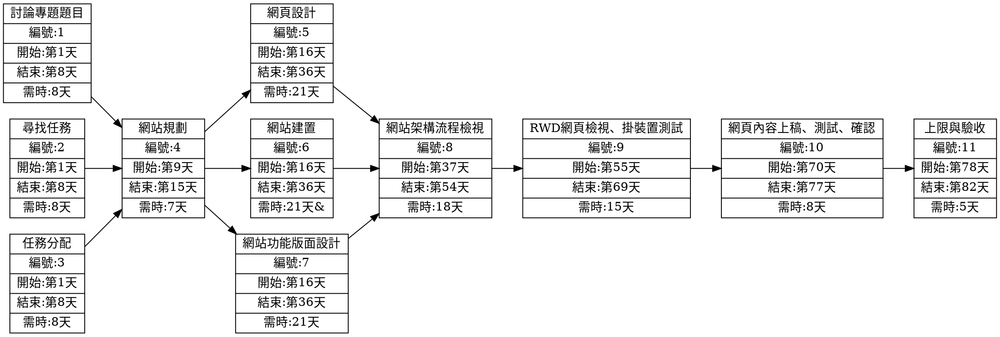

<https://hackmd.io/@SEAJNeFoSDqk2YyfUloRNg/B1k4MIWQj>

```graphviz 
digraph {
	node[shape=record];
	rankdir="LR";
    no1 [label = "討論專題題目 | 編號:1 | 開始:第1天 | 結束:第8天 | 需時:8天"]
    no2 [label = "尋找任務 | 編號:2 | 開始:第1天 | 結束:第8天 | 需時:8天"]
    no3 [label = "任務分配 | 編號:3 | 開始:第1天 | 結束:第8天 | 需時:8天"]
    no4 [label = "網站規劃 | 編號:4 | 開始:第9天 | 結束:第15天 | 需時:7天"]
    {rank=same;no1 no2 no3}
    no1->no4
    no2->no4
    no3->no4
    no5 [label = "網頁設計 | 編號:5 | 開始:第16天 | 結束:第36天 | 需時:21天"]
    no6 [label = "網站建置 | 編號:6 | 開始:第16天 | 結束:第36天 | 需時:21天&"]
    no7 [label = "網站功能版面設計 | 編號:7 | 開始:第16天 | 結束:第36天 | 需時:21天"]
    {rank=same;no5 no6 no7}
    no4->no5
    no4->no6
    no4->no7
    no5->no8
    no6->no8
    no7->no8
    no8 [label = "網站架構流程檢視 | 編號:8 | 開始:第37天 | 結束:第54天 | 需時:18天"]
    no8->no9
    no9 [label = "RWD網頁檢視、掛裝置測試 | 編號:9 | 開始:第55天 | 結束:第69天 | 需時:15天"]
    no9->no10
    no10 [label = "網頁內容上稿、測試、確認 | 編號:10 | 開始:第70天 | 結束:第77天 | 需時:8天"]
    no10->no11
    no11 [label = "上限與驗收 | 編號:11 | 開始:第78天 | 結束:第82天 | 需時:5天"]

}
```
