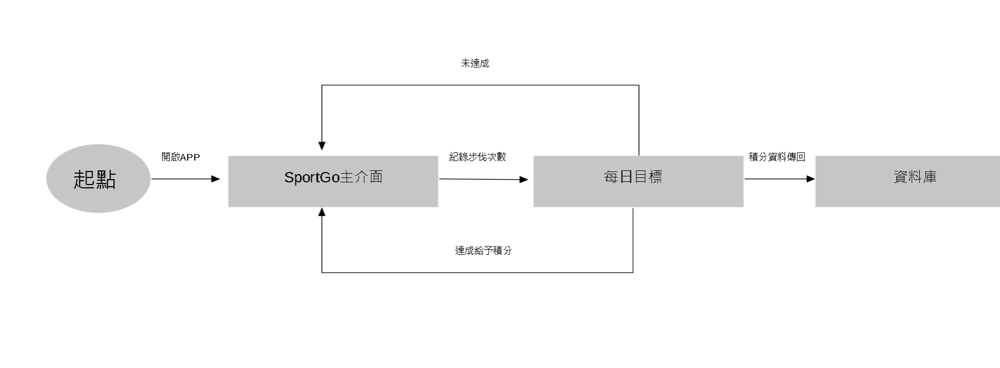

# SAAD-Group11
# 專題主題: SportGo系統

| 職位 | 姓名 | 學號 | 負責任務 |
| :------- | :--------: | :--------: |--------: |
| 組長 | 江浩賢 | B110118302 |功能性需求及非功能性需求、分鏡板、Figma、UML類別圖
| 組員 | 謝秉諭 | C108118185 |使用案例說明、循序圖、PERT/CPM
| 組員 | 林育賢 | C109118134 |活動圖、FDD
| 組員 | 杜佳原 | C109118114 |實體關係圖

# 內容：
>描述內容

SportGo是一款主打move-to-earn靠運動或是走路來賺取軟體代幣的APP，那透過記錄運動所獲取的代幣可以拿來兌換商品區及折扣，目的是希望可以給予民眾去運動的動機，保持健康的體態。

# 甘特圖

# PERT/CPM

### 關鍵路徑：1->2->3->5->8->9->10
# 功能性需求及非功能性需求
### 功能性需求
+ 記錄用家運動時間、消耗熱量
+ 達到指定目標後可以兌換獎勵
+ 可以建立運動社群，一起約去運動
### 非功能性需求
+ 反應時間：1-2秒
+ 使用性：5分鐘
+ 可靠度：同步手機或運動手錶的運動記錄
# FDD

# 需求分析
1. 管理者可以藉由載入(Load) 獎勵貨品清單(Inventory) 資料來產生報表(Inventory Reports) 和儲存貨品資料。
2. 管理者可以藉由載入會員資訊來產生會員報表。
3. 銷售人員(Sales Clerk) 紀錄現場的新會員的資料及獎勵貨品。
4. 任何銷售必須更新存貨。
5. 假如會員使用積分，銷售人員必須查核(Verify)會員是否有足夠積分兌換，基於以上的需求描述，請繪製可能的使用案例圖。
# 使用案例

>使用案例一說明

>使用案例二說明

>使用案例三說明

# Figma
[使用案例的動態模擬畫面](https://www.figma.com/proto/fS5fVLwMrFhlcw1zX3G7Pq/SportGo?node-id=2%3A2&scaling=scale-down&page-id=0%3A1&starting-point-node-id=5%3A4)
# DFD

# DFD0

# UML類別圖

# 循序圖
### 使用案例一

### 使用案例二

### 使用案例三

# 活動圖
#### 使用案例一

#### 使用案例二

#### 使用案例三

# 分鏡板
### storyboard

### storyboard1

### storyboard2

### storyboard3

### storyboard4

### storyboard5

### storyboard6

### storyboard7

# 實體關係圖

